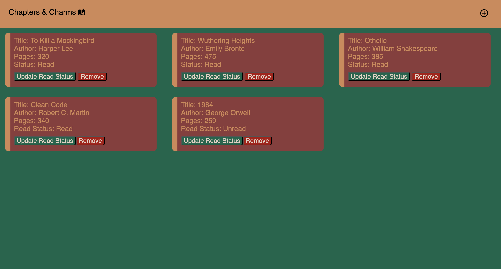
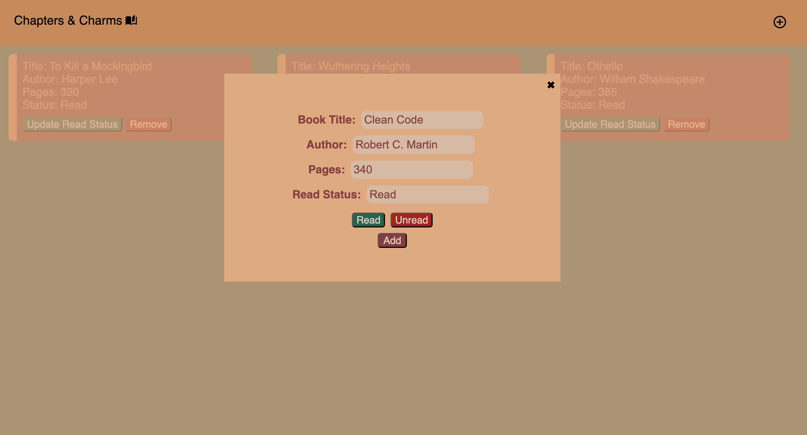

# Chapter & Charms Library
I created a Library book tracker which stores the books a user reads and stores information about the book. For example, the title, author, number of pages and the current read status of the book.

# Key features
- A cool Library colour scheme
- CSS Flexbox and Grid layouts for responsive design
- Interactive HTML Forms: Users can add new books to the library by entering details through a form, improving usability and engagement.

# Usage
- **Adding a Book**: Fill out the form fields and click the "Add" button to add a new book to the library.
- **Updating Read Status**: Click on a book "Update Read Status" to update the book's read status.
- **Removing a Book**: Click the "Remove" button to delete the book from the library.

# Technologies Used
- HTML5
- CSS3 (Flexbox & Grid)
- Javascript

# Credits
- Icons were taken from Material icons

# Screenshot
Here is a preview of the Library 

